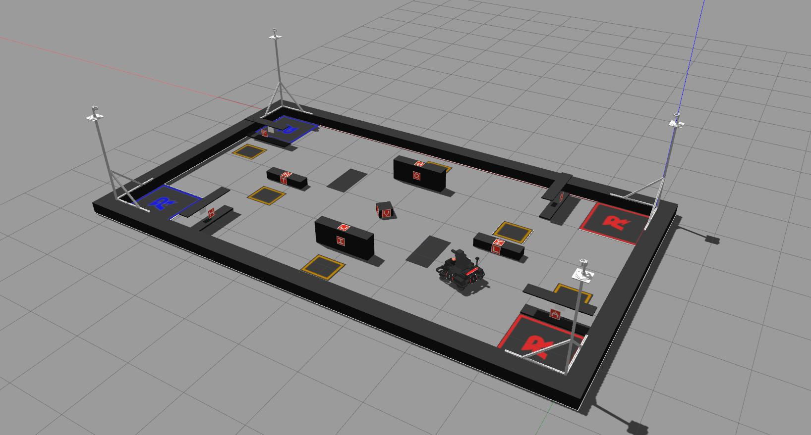

# Zero2Hero RMUA 2022 场地仿真




## 功能介绍

1. 完全实现了场地,绘制了贴图
2. 哨塔添加了相机
3. 车辆添加了相机\雷达\IMU
4. 车辆底盘可控\云台可控

## 启动
``` 
roslaunch rmua_2022_simulation gazebo.launch
```

## 依赖

此仿真雷达采用Gpu插件,请安装显卡驱动后使用

## 透明障碍实现

visual mesh 和 collision mesh 不同,gpu雷达插件会调用 visual mesh, 而碰撞检测会调用 collision mesh, 因此将雷达插件更换为 cpu 插件后,透明属性消失

So basically the gpu laser will only detect a link's visual. One solution to your problem would be to simply delete the

```
<visual name="visual1">
...
</visual>
```

in your sdf. But you would not be able to see the object in the simulation. Another possibility is to delete the

```
<collision name="visual">
...
</collision>
```

Element in your sdf and use the non gpu version of the sensor. This sensor will only detect a link's collision and you will be still able to see the object in the simulation. To do this you also need to change the sensor type:

```
<sensor type="ray" name="hokuyo">
```

and the plugin:

```
<plugin name="gazebo_ros_head_hokuyo_controller" filename="libgazebo_ros_laser.so">
```
